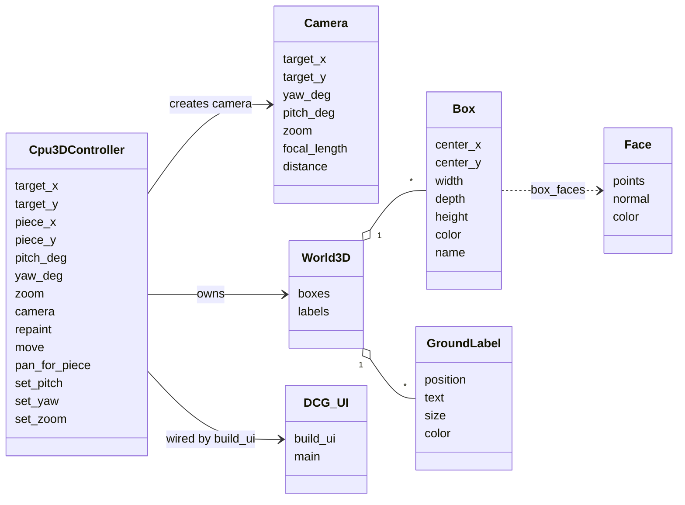

# 11_dearcygui_cpu_3d_map Class Diagram

```mermaid
classDiagram
direction LR

class Camera
class Box
class Face
class GroundLabel
class World3D
class Cpu3DController
class DCG_UI

Camera : target_x
Camera : target_y
Camera : yaw_deg
Camera : pitch_deg
Camera : zoom
Camera : focal_length
Camera : distance

Box : center_x
Box : center_y
Box : width
Box : depth
Box : height
Box : color
Box : name

Face : points
Face : normal
Face : color

GroundLabel : position
GroundLabel : text
GroundLabel : size
GroundLabel : color

World3D : boxes
World3D : labels

Cpu3DController : target_x
Cpu3DController : target_y
Cpu3DController : piece_x
Cpu3DController : piece_y
Cpu3DController : pitch_deg
Cpu3DController : yaw_deg
Cpu3DController : zoom
Cpu3DController : camera
Cpu3DController : repaint
Cpu3DController : move
Cpu3DController : pan_for_piece
Cpu3DController : set_pitch
Cpu3DController : set_yaw
Cpu3DController : set_zoom

DCG_UI : build_ui
DCG_UI : main

World3D "1" o-- "*" Box
World3D "1" o-- "*" GroundLabel
Box ..> Face : box_faces
Cpu3DController --> World3D : owns
Cpu3DController --> Camera : creates camera
Cpu3DController --> DCG_UI : wired by build_ui
```
