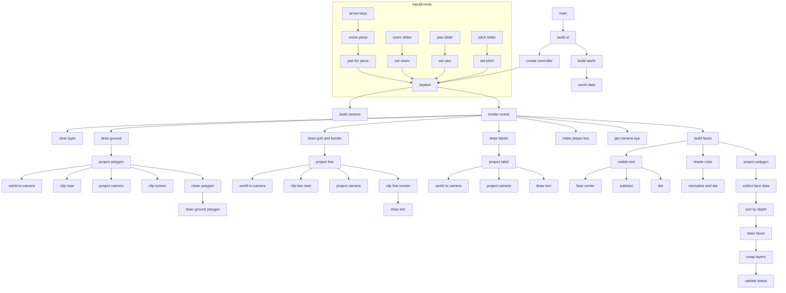

# 11_dearcygui_cpu_3d_map Render Flow

```mermaid
flowchart TD
  A[main] --> B[build ui]
  B --> C[build world]
  C --> C1[world data]
  B --> D[create controller]
  D --> E[repaint]

  subgraph InputEvents
    K1[arrow keys] --> M[move piece]
    K2[pitch slider] --> SP[set pitch]
    K3[yaw slider] --> SY[set yaw]
    K4[zoom slider] --> SZ[set zoom]
    M --> PAN[pan for piece]
    SP --> E
    SY --> E
    SZ --> E
    PAN --> E
  end

  E --> CAM[build camera]
  E --> RS[render scene]
  RS --> CLR[clear layer]

  RS --> G0[draw ground]
  G0 --> PWP1[project polygon]
  PWP1 --> W2C1[world to camera]
  PWP1 --> CPN1[clip near]
  PWP1 --> PRJ1[project camera]
  PWP1 --> CPS1[clip screen]
  PWP1 --> CLN1[clean polygon]
  CLN1 --> DPG[draw ground polygon]

  RS --> GLX[draw grid and border]
  GLX --> PWL[project line]
  PWL --> W2C2[world to camera]
  PWL --> CLN2[clip line near]
  PWL --> PRJ2[project camera]
  PWL --> CLS[clip line screen]
  CLS --> DLI[draw line]

  RS --> LAB[draw labels]
  LAB --> PGL[project label]
  PGL --> W2C3[world to camera]
  PGL --> PRJ3[project camera]
  PGL --> DTX[draw text]

  RS --> PIECE[make player box]
  RS --> EYE[get camera eye]

  RS --> FACES[build faces]
  FACES --> VIS[visible test]
  VIS --> FC[face center]
  VIS --> SUB[subtract]
  VIS --> DOT[dot]
  FACES --> PWP2[project polygon]
  FACES --> SHADE[shade color]
  SHADE --> NRM[normalize and dot]
  PWP2 --> RLIST[collect face data]

  RLIST --> SORT[sort by depth]
  SORT --> DPF[draw faces]

  DPF --> SWAP[swap layers]
  SWAP --> STATUS[update status]
```
