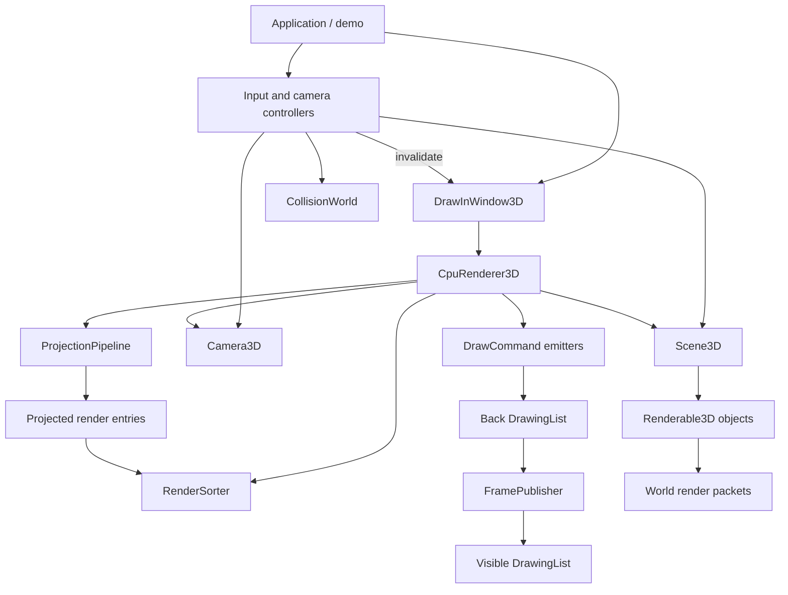

# DrawInWindow 3D Framework: Initial High-Level Design

## Status

This document is the starting design for extracting the CPU-side 3D pipeline
developed across demos 11 through 14 into a reusable DearCyGui framework.
Names and signatures are proposals, not yet stable public API.

The source implementations are:

- `../11_dearcygui_cpu_3d_map.py`: camera math, clipping, projection,
  back-face culling, simple painter ordering, camera follow, and atomic layer
  replacement.
- `../11_1_dearcygui_cpu_3d_bitmap.py`: tessellated texture mapping,
  persistent billboard animation, and preprojected `DrawStream` animation.
- `../12_dearcygui_cpu_3d_map.py`: footprint collision and deterministic
  painter-sort tie breaking.
- `../13_dearcygui_cpu_3d_overlap_sort.py`: screen-overlap tests,
  ray-plane depth comparison, topological ordering, and cycle fallback.
- `../13_1_dearcygui_cpu_3d_bitmap.py`: textured objects combined with the
  overlap-aware renderer.
- `../14_dearcygui_cpu_3d_trees.py`: camera-facing animated billboards that
  participate in scene occlusion.

## Direction

The framework should expose a `DrawInWindow3D` widget that can be placed where
a `dcg.DrawInWindow` is used today. The widget should own DearCyGui drawing
resources and frame publication, but it should not contain all 3D behavior.
Projection, scene traversal, render ordering, materials, collision, and camera
control should be composed services with useful pure-Python boundaries.

The first implementation should investigate subclassing `dcg.DrawInWindow`:

```python
class DrawInWindow3D(dcg.DrawInWindow):
    ...
```

If the DearCyGui extension type cannot be safely subclassed, the same public
behavior should be provided by a wrapper that owns a `dcg.DrawInWindow`.
Application code should not otherwise depend on which integration is used.

This distinction is deliberate:

- `DrawInWindow3D` is the viewport and DearCyGui adapter.
- `Scene3D` is the retained world model.
- `CpuRenderer3D` converts the scene into ordered drawing commands.
- Controllers mutate the scene and camera, then request a redraw.

## Goals

1. Replace the copied `render_scene()` functions with one extensible render
   pipeline.
2. Preserve demo 11's camera transform and robust geometry-clipping pipeline,
   while explicitly rejecting its incomplete textured-quad clipping and simple
   painter ordering as framework defaults.
3. Make average-depth and overlap-aware ordering selectable strategies.
4. Support solid faces, textured faces, labels, lines, ground surfaces,
   billboards, and preprojected animation without special cases in the main
   scene loop.
5. Keep camera movement, player movement, collision, and UI controls outside
   the renderer.
6. Preserve atomic front/back `DrawingList` publication so partially rebuilt
   scenes are never displayed.
7. Make the math and ordering layers testable without opening a viewport.
8. Allow demos 11 through 14 to become small examples configured from the
   same framework rather than an import chain.
9. Support opaque engineering surface meshes and boundary-surface views of
  tetrahedral meshes without requiring one Python scene object per element.

## Non-Goals for the First Version

- A per-pixel depth buffer or general triangle rasterizer.
- Arbitrary intersecting or concave geometry.
- Perspective-correct texture interpolation without tessellation.
- GPU or shared-OpenGL rendering.
- A full physics engine, entity-component system, or asset pipeline.
- True volumetric rendering, physically correct attenuation,
  order-independent transparency, or finite-element solving. The framework
  may display solver results but does not compute them.
- Internal tetrahedral inspection, section planes, cutaways, exploded cells,
  or guaranteed-correct translucent volume views. Tetrahedral input normally
  derives its exterior surface; small externally selected subsets may use an
  explicitly approximate translucent preview.
- Automatic continuous redraw. Redraw remains event-driven unless an object
  explicitly requires a new projected frame.

## Lessons from the Demo Progression

| Demo | Capability added | Framework responsibility |
|---|---|---|
| 11 | Camera transforms, near/screen clipping, projection, culling, shading, painter ordering | `Camera3D`, `ProjectionPipeline`, geometry utilities, `AverageDepthSorter` |
| 11 | Edge-band follow and double-buffered scene replacement | `EdgeBandFollowController`, `FramePublisher` |
| 11.1 | Tessellated face texture and persistent billboard animation | Material/draw-command types and animation projection policies |
| 12 | AABB footprint collision | Optional `CollisionWorld` service, independent of rendering |
| 13 | Overlap-aware topological face ordering | `OverlapDepthSorter` with cycle diagnostics and fallback |
| 13.1 | Textures combined with overlap ordering | Render entries carry material commands without changing the sorter |
| 14 | Animated tree billboards in the occlusion graph | `Billboard3D` emits sortable geometry plus an image/animation draw command |

The repeated code shows the main extraction pressure: adding a visual type
currently requires copying the whole scene renderer and expanding its argument
list. The framework must instead let each scene object produce render entries
that the common pipeline can project, order, and draw.

## Behavioral Compatibility Baseline

The framework is not intended to reproduce every demo 11 behavior. Demo 11 is
the math and drawing foundation; later demos define the preferred behavior
where they supersede it.

| Area | Preserve from demo 11 | Superseded behavior to avoid | Canonical behavior |
|---|---|---|---|
| Camera | Yaw-then-pitch transform, screen-down camera y, focal length/zoom relationship, ground-ray conversion | Module-level viewport constants in reusable math | Instance-scoped `Camera3D` and `Viewport` with the same transform conventions |
| Geometry clipping | Camera-space near-plane clipping before projection; screen-space polygon/line clipping after projection; cleanup of duplicate, collinear, and zero-area polygons | Projecting geometry before near clipping or independently clamping polygon vertices | Demo 11's ordered clipping pipeline, parameterized by viewport and near plane |
| Textured clipping | Solid geometry remains visible when a texture cannot be mapped safely | Assuming an unclipped four-corner image can represent a clipped quad | Demo 11.1/13.1 solid shaded fallback until UV-aware clipping exists |
| Collision | World-bound clamping of the player candidate | Mutating position first or allowing the player to intersect boxes as in demo 11 | Demo 12 candidate-first AABB validation with a configurable separation gap |
| Render ordering | Average depth remains available as a deterministic fallback and low-cost option | Average-depth painter order as the general default | Demo 13 overlap-aware topological order, with cycle fallback to stable average depth |
| Animation | Event-driven projection and DearCyGui-owned frame cycling | Rebuilding every animation on every viewport frame, or treating every stream as an overlay | The three ownership and ordering contracts defined below |
| Publication | Build into a hidden layer and swap visibility under the owning mutex | Drawing incrementally into the visible layer | Atomic front/back publication used throughout demos 11-14 |

New small-scene framework examples should use `OverlapDepthSorter` by default.
Selecting `AverageDepthSorter` must be an explicit performance or compatibility
choice. Large indexed meshes are a separate workload and must not enter the
pairwise overlap sorter without spatial acceleration or a documented face-count
limit.

## Proposed Architecture



### Layer 1: Geometry and Camera Math

This layer has no DearCyGui dependency.

```python
Vec2 = tuple[float, float]
Vec3 = tuple[float, float, float]
Color = tuple[int, int, int] | tuple[int, int, int, int]

@dataclass(frozen=True)
class Viewport:
    width: float
    height: float

@dataclass(frozen=True)
class Camera3D:
    target: Vec3
    yaw_deg: float
    pitch_deg: float
    zoom: float
    fov_y_deg: float = 58.0
    near_plane: float = 25.0

    def eye(self, viewport: Viewport) -> Vec3: ...
    def world_to_camera(self, point: Vec3, viewport: Viewport) -> Vec3: ...
    def camera_to_screen(self, point: Vec3, viewport: Viewport) -> Vec2: ...
    def ground_from_screen(
        self, screen: Vec2, viewport: Viewport, ground_z: float = 0.0
    ) -> Vec3 | None: ...
```

`ProjectionPipeline` owns near-plane clipping, viewport clipping, polygon
cleanup, and line/polygon projection. Viewport dimensions and camera settings
must be instance data rather than module constants.

```python
class ProjectionPipeline:
    def project_polygon(
        self, points: Sequence[Vec3]
    ) -> ProjectedPolygon | None: ...

    def project_line(self, start: Vec3, end: Vec3) -> ProjectedLine | None: ...

    def project_complete_quad(
        self, points: Sequence[Vec3]
    ) -> ProjectedQuad | None: ...
```

The initial math should be extracted with minimal changes from demo 11. In
particular, yaw must be applied before pitch, camera-space coordinates remain
`(right, screen_down, forward_depth)`, and projection must never occur before
near-plane clipping.

  The clipping contract is deliberately ordered:

  1. Transform world points into camera space.
  2. Clip polygons and lines against `depth >= near_plane` in camera space.
  3. Reject primitives with too few points before perspective division.
  4. Project surviving points into screen space.
  5. Clip projected geometry against the viewport rectangle.
  6. Remove adjacent duplicates, collinear vertices, and zero-area polygons
     using a configurable numeric epsilon initially matching demo 11's `1e-5`.
  7. Submit only cleaned geometry to ordering and DearCyGui triangulation.

  `project_complete_quad()` is intentionally stricter than general polygon
  projection. It returns `None` if any corner is behind the near plane or outside
  the viewport. A textured material then emits the clipped, shaded solid polygon
  instead. This preserves visible geometry without pretending that the original
  four UV corners describe a newly clipped polygon. UV-aware clipping can later
  replace this fallback without changing the object or sorting interfaces.

### Layer 2: Scene Model

`Scene3D` stores world objects but does not draw them. A renderable emits one
or more world-space packets. Packets separate geometry used for clipping and
ordering from the command used to draw the final projected result.

```python
class Renderable3D(Protocol):
    visible: bool

    def collect(self, frame: FrameContext) -> Iterable[WorldRenderPacket]: ...

@dataclass
class Scene3D:
    objects: list[Renderable3D]
    background: Color = (19, 24, 31)

  def add(self, item: Renderable3D) -> ObjectHandle: ...
  def remove(self, handle: ObjectHandle) -> None: ...
```

Initial object types should be:

- `Box3D`: emits back-face-culled polygon packets for six axis-aligned faces.
- `Polygon3D`: emits a solid or textured planar polygon.
- `Line3D` and `Polyline3D`: grid, border, debug, and utility geometry, with
  an explicit render-layer policy.
- `Text3D`: projected labels with perspective-scaled size.
- `Billboard3D`: emits a camera-facing quad and an image or animation command.
- `GroundPlane3D`: convenience object for large clipped ground polygons.
- `TriangleMesh3D`: indexed vertices and triangular faces emitted efficiently
  as one retained renderable rather than many `Polygon3D` objects.
- `TetrahedralMesh3D`: tetrahedral topology plus result fields; derives the
  original exterior surface triangles from its cells.

Objects should own transforms and materials. They should not receive a DCG
parent and should not mutate the visible drawing tree directly.

#### Object Initialization Sketch

The exact constructors remain provisional, but a canonical scene should be
expressible without passing DearCyGui parents or projected coordinates into
scene objects:

```python
scene = Scene3D(background=(19, 24, 31))

ground = scene.add(GroundPlane3D(
  name="terrain",
  bounds=(0.0, 0.0, 1600.0, 1200.0),
  z=0.0,
  material=SolidMaterial(fill=(42, 66, 47), outline=None),
))

storehouse = scene.add(Box3D(
  name="storehouse",
  transform=Transform3D(position=(820.0, 980.0, 0.0)),
  size=(260.0, 220.0, 180.0),
  material=SolidMaterial(
    fill=(93, 136, 170),
    outline=(24, 27, 25),
    outline_thickness=2.0,
    shaded=True,
  ),
))

river = scene.add(Polygon3D(
  name="river",
  points=(
    (0.0, 620.0, 1.0),
    (1600.0, 620.0, 1.0),
    (1600.0, 710.0, 1.0),
    (0.0, 710.0, 1.0),
  ),
  material=SolidMaterial(fill=(68, 116, 168), outline=None),
  cull_back_face=False,
))

grid_line = scene.add(Line3D(
  name="grid-x-400",
  start=(400.0, 0.0, 3.0),
  end=(400.0, 1200.0, 3.0),
  color=(65, 91, 68),
  thickness=1.0,
  render_layer=LineRenderLayer.UTILITY,
))

boundary = scene.add(Polyline3D(
  name="world-boundary",
  points=(
    (0.0, 0.0, 5.0),
    (1600.0, 0.0, 5.0),
    (1600.0, 1200.0, 5.0),
    (0.0, 1200.0, 5.0),
  ),
  closed=True,
  color=(235, 214, 116),
  thickness=3.0,
))

label = scene.add(Text3D(
  name="storehouse-label",
  position=(820.0, 1080.0, 4.0),
  render_layer=LineRenderLayer.UTILITY,
  text="Storehouse",

measurement_ray = scene.add(Line3D(
  name="range-check",
  start=(820.0, 980.0, 90.0),
  end=(1110.0, 980.0, 90.0),
  color=(255, 180, 80),
  thickness=2.0,
  render_layer=LineRenderLayer.WORLD,
))
  world_size=28.0,
  color=(235, 235, 220),
  min_screen_size=8.0,
  max_screen_size=18.0,
))

oak = scene.add(Billboard3D(
  name="oak",
  anchor=(655.0, 540.0, 0.0),
  world_size=(150.0, 255.0),
  facing=BillboardFacing.CAMERA_YAW,
  material=AnimatedImageMaterial(
    frames=tree_textures,
    loop_seconds=1.25,
    projection_policy=AnimationProjection.OCCLUDABLE_WORLD,
    frame_offset=0,
  ),
))
```

The returned values are stable `ObjectHandle` instances. An application keeps
only the handles it needs to query, move, replace, select, or remove. Static
objects may be added without retaining their handles.

Geometry placement uses one of two forms:

- Primitive objects such as `Box3D` use a reusable `Transform3D` plus local
  dimensions.
- Explicit world geometry such as `Polygon3D`, `Line3D`, and `Polyline3D`
  accepts world points directly in the initial API.

Whether every object should instead use local geometry plus `Transform3D` is
an open question because a uniform transform model helps CAD editing, while
direct world points keep maps and generated linework simple.

#### Engineering Mesh Initialization Sketch

An opaque tetrahedral model can be viewed with the existing projected polygon
pipeline after its exterior faces are extracted. The application should pass
indexed arrays once; it should not construct a `Polygon3D` for every face or a
scene object for every tetrahedron.

```python
model = scene.add(TetrahedralMesh3D(
  name="bracket-result",
  vertices=nodes_xyz,           # Sequence[Vec3], length N
  cells=tetrahedra,             # Sequence[tuple[int, int, int, int]], length M
  transform=Transform3D.identity(),
  material=ScalarFieldMaterial(
    values=von_mises_by_cell,   # One scalar per tetrahedron
    color_map=ColorMap.TURBO,
    value_range=(0.0, 320.0),
    out_of_range=OutOfRange.CLAMP,
  ),
  edges=MeshEdgeStyle(color=(35, 35, 35, 110), thickness=1.0),
))
```

The same rendering path should also accept a surface-only mesh when topology
has already been extracted by a CAE library:

```python
skin = scene.add(TriangleMesh3D(
  name="bracket-skin",
  vertices=surface_nodes_xyz,
  triangles=surface_triangles,
  transform=Transform3D.identity(),
  material=SolidMaterial(fill=(105, 145, 190), shaded=True),
  edges=None,
))
```

A translucent surface uses the same triangles with an RGBA material. It must
be double-sided so the far side of the closed surface remains visible:

```python
transparent_skin = scene.add(TriangleMesh3D(
  name="transparent-bracket-skin",
  vertices=surface_nodes_xyz,
  triangles=surface_triangles,
  transform=Transform3D.identity(),
  material=SolidMaterial(
    fill=(80, 155, 220, 70),
    shaded=True,
    blend=BlendMode.ALPHA,
  ),
  cull_back_faces=False,
  edges=MeshEdgeStyle(color=(25, 45, 60, 120), thickness=1.0),
))
```

`TetrahedralMesh3D` is a topology-aware scene object, not a new DearCyGui draw
primitive. It converts visible tetrahedral topology into triangle packets that
the common culling, projection, clipping, ordering, and draw-command pipeline
can consume.

For exterior-surface extraction, each tetrahedron contributes four candidate
triangle faces. A face keyed by its three sorted vertex indices is exterior
only when it occurs once among the currently visible cells. Its emitted winding
must be oriented away from the tetrahedron's opposite vertex so normals,
back-face culling, and lighting remain correct. Shared interior faces are not
submitted to the renderer.

This supports several useful CAE views:

- Opaque exterior skin with optional triangle edges.
- Per-cell scalar results using one flat color per exposed triangle.
- Per-node scalar results when the material provides an explicit interpolation
  or tessellation policy.
- Displaced exterior geometry when the application supplies transformed node
  positions.

The boundary extractor always operates on the complete input topology and
emits only faces occurring once in that topology. Hiding cells does not reveal
their neighbors, and the framework does not generate section or cut faces.
Applications needing internal inspection should preprocess a separate surface
mesh externally and submit it as `TriangleMesh3D`.

#### Translucent Mesh Capability

RGBA triangle fills make translucent tetrahedral views possible, but they do
not make them order-independent or physically volumetric. The framework can
offer these bounded use cases:

- **Translucent exterior shell:** render the tetrahedral mesh's extracted
  exterior faces as double-sided alpha triangles.
- **Selected tetrahedra:** an application externally selects a small cell
  subset, extracts that subset's boundary, and submits the resulting triangles
  as a translucent `TriangleMesh3D`.
- **Diagnostic tetrahedral faces:** an application may submit a preprocessed
  unique-face triangle mesh to reveal cell structure, accepting that this is a
  visual aid rather than a correct volume representation.

All translucent triangles must participate in one global far-to-near order
with other scene surfaces. The existing overlap sorter can improve ordering for
small triangle sets, but intersecting geometry, cyclic overlap constraints,
coplanar faces, and cycle fallback can still produce blending artifacts. Shared
tetrahedral faces should normally be deduplicated; drawing both copies doubles
their apparent opacity and creates unstable coplanar ordering.

Therefore translucent mesh viewing is an explicitly approximate preview. It is
reasonable for a single tetrahedron, an exterior shell, or a modest selected
subset. Large all-cell translucent models require a depth-aware or
order-independent backend and are not a correctness target for
`CpuRenderer3D`.

#### Engineering Mesh Usage Examples

These examples are pseudocode. File parsing, finite-element calculations, cell
selection, and boundary extraction remain external to the rendering framework.

**Opaque tetrahedral result.** The application passes solver arrays once and
keeps the returned handle for later result or displacement updates:

```python
nodes_xyz, tetrahedra, result_steps = cae_reader.load("bracket.fem")

mesh = view.add(TetrahedralMesh3D(
  name="bracket",
  vertices=nodes_xyz,
  cells=tetrahedra,
  transform=Transform3D.identity(),
  material=ScalarFieldMaterial(
    values=result_steps[0].von_mises_by_cell,
    association=FieldAssociation.CELL,
    color_map=ColorMap.TURBO,
    value_range=(0.0, 320.0),
  ),
  edges=MeshEdgeStyle(color=(30, 30, 30, 100), thickness=1.0),
))

view.render_now()
```

`TetrahedralMesh3D` extracts and caches the original exterior triangles. It
maps each exterior triangle back to its owning cell so a cell-associated field
can color that triangle and later picking can report the source cell.

**Switch result fields or time steps.** A UI handler replaces field data on the
same retained mesh; topology and exterior-face extraction remain reusable:

```python
def show_result_step(sender, target, value) -> None:
  step = result_steps[int(value)]
  view.update_object(
    mesh,
    material=ScalarFieldMaterial(
      values=step.von_mises_by_cell,
      association=FieldAssociation.CELL,
      color_map=ColorMap.TURBO,
      value_range=result_range,
    ),
  )


dcg.Slider(
  context,
  label="Result step",
  min_value=0,
  max_value=len(result_steps) - 1,
  callback=show_result_step,
)
```

**Display displaced geometry.** The application or solver computes displaced
node positions. Replacing vertices invalidates projection but not tetrahedral
connectivity:

```python
def set_deformation_scale(scale: float) -> None:
  displaced = nodes_xyz + scale * result_steps[current_step].displacement
  view.update_object(mesh, vertices=displaced)
```

The exact array expression depends on the application's NumPy or buffer types.
The framework API receives the resulting indexed vertex array.

**Approximate translucent exterior shell.** The application can either use the
cached exterior of `TetrahedralMesh3D` with an alpha material or submit an
already extracted `TriangleMesh3D`:

```python
view.update_object(
  mesh,
  material=SolidMaterial(
    fill=(80, 155, 220, 70),
    shaded=True,
    blend=BlendMode.ALPHA,
  ),
  cull_back_faces=False,
  edges=MeshEdgeStyle(color=(25, 45, 60, 120), thickness=1.0),
)
```

The renderer emits the exterior triangles double-sided and orders them
far-to-near. The result is an approximate shell preview, not volume rendering.

**Selected tetrahedral subset.** Selection and subset-boundary extraction are
external. The generated boundary is submitted as one `TriangleMesh3D` object:

```python
selected_cells = selection_model.selected_cell_indices()
subset_vertices, subset_triangles, source_cells = cae_mesh.extract_boundary(
  vertices=nodes_xyz,
  cells=tetrahedra[selected_cells],
  source_cell_ids=selected_cells,
)

selected_preview = view.add(TriangleMesh3D(
  name="selected-cells",
  vertices=subset_vertices,
  triangles=subset_triangles,
  source_ids=source_cells,
  material=SolidMaterial(
    fill=(245, 155, 65, 85),
    shaded=True,
    blend=BlendMode.ALPHA,
  ),
  cull_back_faces=False,
  edges=MeshEdgeStyle(color=(90, 45, 15, 160), thickness=1.0),
))
```

When selection changes, the application may remove and recreate this preview
or replace its indexed arrays through `update_object()`. `source_ids` preserves
the mapping from each emitted boundary triangle to the original solver cell.

**Surface mesh without tetrahedral topology.** CAD tessellation, STL data, and
externally prepared CAE skins use `TriangleMesh3D` directly:

```python
surface = view.add(TriangleMesh3D(
  name="housing",
  vertices=surface_vertices,
  triangles=surface_triangles,
  transform=Transform3D(
    position=(250.0, 0.0, 0.0),
    rotation_deg=(0.0, 0.0, 90.0),
  ),
  material=SolidMaterial(fill=(120, 145, 175), shaded=True),
  edges=None,
))

# A CAD manipulator uses the same object-handle API as simpler scene objects.
view.update_object(surface, transform=manipulator.current_transform)
```

Large engineering meshes also change the performance assumptions. Demo 13's
overlap sorter compares projected faces pairwise and is therefore unsuitable
as the default for tens of thousands of triangles. Mesh rendering needs coarse
frustum culling, cached boundary extraction, optional spatial partitioning,
and a mesh-specific ordering strategy. A depth-buffered backend may eventually
be preferable, while retaining `Scene3D` and the same mesh-facing public API.

Until spatial acceleration exists, treat `OverlapDepthSorter` as a small-scene
quality mode for mesh previews. It performs pairwise projected-face checks, so
roughly 500 visible mesh triangles is the practical upper bound for interactive
use on the pure-Python path. For larger `TriangleMesh3D` skins or
`TetrahedralMesh3D` exteriors, configure `CpuRenderer3D(sorter=AverageDepthSorter())`
when approximate painter ordering is acceptable, or decimate/filter the visible
surface before rendering. Scenes in the thousands of faces should be profiled
before enabling overlap-aware ordering, and tens-of-thousands-face engineering
models should wait for spatial indexing or a depth-buffered backend.

### Layer 3: Render Packets and Materials

One common representation must replace the progressively expanded
`RenderFace` dataclasses in demos 13 and 14.

```python
@dataclass(frozen=True)
class WorldRenderPacket:
    world_points: tuple[Vec3, ...]
    material: Material3D
    line_occluder: bool | None = None
    primitive: PrimitiveKind
    cull_back_face: bool = False
    sort_layer: int = 0
    source_id: int = 0

@dataclass(frozen=True)
class ProjectedRenderEntry:
    world_points: tuple[Vec3, ...]
    screen_points: tuple[Vec2, ...]
    average_depth: float
    material: Material3D
    line_occluder: bool = True
    primitive: PrimitiveKind
    sort_layer: int
    stable_index: int
```

Proposed initial materials:

- `SolidMaterial`: RGBA fill, outline, thickness, optional directional shading,
  opaque or alpha blend mode, and a `line_occluder` flag that defaults to
  `True` for normal solid faces.
- `ImageMaterial`: texture, UV coordinates, and tessellation policy.
- `AnimatedImageMaterial`: textures or prebuilt frame source plus loop timing.
- `ScalarFieldMaterial`: per-cell or per-node values, color mapping, value
  range, missing-value behavior, and an explicit interpolation policy.

The sorter reads only geometry, depth, layer, and stable index. It must not
need to know whether an entry becomes a `DrawPolygon`, `DrawImage`, or
`DrawStream`. This is the central extension point demonstrated by demo 14.

Mesh packets should preserve a compact `source_id` identifying the originating
cell, face, or region. Picking and diagnostics can then map a projected triangle
back to engineering data without turning every element into a scene object.

Any future primitive family added through `WorldRenderPacket` must also define
its occlusion contract against existing primitive families. A primitive is not
considered fully designed merely because it can be projected and emitted. If
it can span both visible and hidden regions in the same frame, then its
visibility behavior must be reviewed explicitly rather than assuming one scalar
depth for the whole primitive is sufficient.

### Layer 4: Ordering Strategies

```python
@dataclass(frozen=True)
class SortResult:
    entries: tuple[ProjectedRenderEntry, ...]
    cycle_detected: bool = False

class RenderSorter(Protocol):
    def order(
        self, entries: Sequence[ProjectedRenderEntry], frame: FrameContext
    ) -> SortResult: ...

class AverageDepthSorter:
    ...

class OverlapDepthSorter:
    ...
```

`AverageDepthSorter` preserves demos 11 and 12. `OverlapDepthSorter` extracts
demo 13's convex screen-polygon intersection, ray-plane depth sample, and
topological sort. It falls back to stable average-depth order when a cycle is
detected and reports that through `SortResult`.

`OverlapDepthSorter` is the default for new scenes. `AverageDepthSorter` is a
lower-cost strategy for known-separated convex geometry and the deterministic
fallback when overlap constraints form a cycle. A `stable_index` is assigned
in packet collection order and used to resolve equal depths and cycle fallback
consistently across equivalent frames.

That default applies to the small object scenes represented by demos 11-14.
`TriangleMesh3D` and `TetrahedralMesh3D` require a scalable visibility policy.
Candidates include screen-bounds acceleration of overlap tests, spatial/BSP
ordering, a documented approximate depth order, or a depth-buffered backend.
The public mesh API should not depend on which policy is selected.

The first version continues to assume convex planar faces. Splitting
intersecting polygons is a future renderer, not an implicit promise of the
overlap sorter.

#### Primitive Occlusion Review Rule

Every new primitive added to the framework must answer this question before it
is accepted: can one instance of the primitive be partly in front of another
primitive and partly behind it within one frame?

If the answer is yes, average-depth ordering of the whole primitive is suspect
by default. The implementation must explicitly choose and document one of
these approaches:

- Split or clip the primitive into separately orderable visible fragments.
- Convert the primitive into polygonal approximations that can participate in
  the polygon occlusion path.
- Declare the primitive an intentional approximation or overlay with documented
  occlusion limits.

This rule is based on issues already exposed by the demos:

- Demo 11 showed that average-depth ordering is too coarse for some projected
  overlaps.
- Demo 13 improved polygon-vs-polygon ordering with overlap-aware depth
  sampling and topological sorting.
- Line-vs-face partial occlusion is handled by splitting the projected line at
  polygon silhouette intersections, then depth-testing each subsegment against
  nearer faces before emitting DearCyGui line commands.

The framework deliberately keeps `Line3D` and `Polyline3D` as native line
packets rather than converting them into thin polygons. Splitting line segments
preserves stroke thickness, cap behavior, and the existing draw-command API
while fixing the specific artifact exposed by grid and border lines crossing box
faces. Thin-polygon substitution would move stroke semantics into polygon fill
rules, add more faces to the overlap graph, and still need separate handling
for line joins. This design choice was made during OpenSpec sub-milestone 3C,
specifically while completing tasks 3.14 through 3.16: implementing line-vs-
face partial occlusion, adding partial-occlusion tests, and documenting the
chosen approach.

The current renderer implements that choice in a deliberately narrow way. After
polygon entries are ordered, each projected line checks only the polygons whose
screen-space bounds overlap its bounds. The renderer collects the line's
intersection parameters against those polygon edges, sorts the resulting
intervals, and samples each interval at its midpoint. At that sample point it
computes the line depth from the clipped camera-space endpoints and compares it
against the polygon plane depth already used by overlap-aware face ordering. If
the sampled subsegment is behind a nearer polygon face, that interval is
suppressed; otherwise the subsegment is emitted as a normal DearCyGui line.

That line-depth pass now treats polygon ordering and polygon line-occlusion as
related but separate decisions. Solid faces continue to occlude world lines by
default, but a polygon packet can override that policy directly and
`SolidMaterial` also carries a `line_occluder` role. The renderer resolves the
effective policy during projection, stores it on the projected polygon entry,
and uses it only for the later line-fragment depth test. This keeps decorative
surfaces such as demo 11's road and water bands in normal back-to-front polygon
ordering while preventing them from punching holes in linework.

Milestone 4 adds one more distinction: not every line is a first-class world
line. `Line3D` and `Polyline3D` now expose a `LineRenderLayer` policy.

- `LineRenderLayer.WORLD` keeps the existing hidden-line behavior. The line is
  projected, split against occluding polygons, and emitted in the normal world
  pass. Use this for geometry whose relationship to walls, boxes, and other
  solid faces matters.
- `LineRenderLayer.UTILITY` deliberately demotes the line. Utility lines are
  emitted after terrain-like underlay polygons but before the main world pass.
  They are not split against billboards or buildings, and they are expected to
  lose visually to later world primitives.

This policy is the current answer to demo 14's tree problem. Tree billboards
remain ordinary world primitives: their quads still participate in polygon
depth ordering against boxes and other world faces, so a wall can hide a tree
and a tree can still sort against the player. The floor grid and world border,
however, are no longer treated as peers of those billboard quads. They are
utility lines whose job is orientation and measurement, not authoritative world
occlusion.

The practical consequence is straightforward:

- If a tree billboard is emitted after a utility grid line, opaque tree texels
  cover the line and transparent texels still reveal it. This matches the
  desired demo 14 result.
- If a building polygon is emitted after that same utility line, the building
  simply covers the line. There is no attempt to preserve "line in front of
  wall" semantics for this layer.
- If a future measurement ray, targeting beam, or selection outline needs to
  participate in hidden-line logic, it should stay on `LineRenderLayer.WORLD`
  rather than being placed on the utility layer.

This is a pragmatic design statement, not an accidental compromise: polygons,
billboards, and projected images are the primary world primitives; utility
lines are a lower-priority annotation layer. That matches the current DND-style
use case where the floor grid is important for play but less important than the
visual correctness of buildings, sprites, and textured faces.

This is a pragmatic milestone choice, not a full hidden-line system. Midpoint
sampling is sufficient here because the split points already isolate changes in
polygon coverage, and the current demos use planar faces with straight line
segments. If future primitives introduce curved coverage, thick-stroke joins,
or more complex visibility changes within one interval, that behavior should be
reviewed explicitly rather than assumed to fall out of the polygon sorter.

Future primitives such as circles, ellipses, arcs, thick strokes, sprites,
billboards, or other hybrid drawables should be assumed to need this review.

### Layer 5: CPU Renderer

```python
class CpuRenderer3D:
    def __init__(
        self,
        sorter: RenderSorter | None = None,
        lighting: LightingModel | None = None,
    ) -> None: ...

    def render(
        self,
        context: dcg.Context,
        parent: dcg.DrawingList,
        scene: Scene3D,
        camera: Camera3D,
        viewport: Viewport,
    ) -> RenderStats: ...
```

The render lifecycle is:

1. Create an immutable `FrameContext` from camera and viewport state.
2. Traverse visible scene objects and collect world packets.
3. Cull and project each packet through `ProjectionPipeline`.
4. Assign stable indices and collect projected entries.
5. Order occludable entries with the configured `RenderSorter`.
6. Emit DearCyGui draw items into the hidden back layer in ordered passes.
  Underlay polygons such as ground or decorative bands render first,
  non-occludable preprojected background streams render immediately after
  those underlays, utility lines render next, and primary world entries render
  last. This is what lets demo 14's water shimmer sit on top of the river band
  without promoting it into the main world pass. An occludable animation
  stream is created at its entry's exact position within the primary world
  pass, not in a later overlay pass. World-line entries are split into visible
  subsegments at polygon intersections so only the portions behind nearer
  solid faces are suppressed.
7. Return diagnostics such as packet counts, clipped counts, and cycle state.

When a textured entry fails `project_complete_quad()`, the renderer emits its
already clipped solid polygon using the material's shaded fallback color. It
must not pass the unclipped corners to `DrawImage` or omit the face.

Opaque world surfaces should be ordered together. Explicit overlay layers,
such as the always-visible star in demos 11.1 and 14, are rendered after world
geometry and are not accidentally inserted into the occlusion graph.

### Layer 6: DearCyGui Integration

```python
class DrawInWindow3D(dcg.DrawInWindow):
    scene: Scene3D
    camera: Camera3D
    renderer: CpuRenderer3D

  def add(self, item: Renderable3D) -> ObjectHandle: ...
  def remove(self, handle: ObjectHandle) -> None: ...
  def update_object(self, handle: ObjectHandle, **changes: object) -> None: ...
  def set_camera(self, camera: Camera3D) -> None: ...
  def orbit(
    self, *, yaw_delta_deg: float = 0.0, pitch_delta_deg: float = 0.0
  ) -> Camera3D: ...
  def pan_world(
    self, dx: float, dy: float, dz: float = 0.0
  ) -> Camera3D: ...
  def zoom_by(self, factor: float) -> Camera3D: ...
  def focus_on(self, target: Vec3) -> Camera3D: ...
  def invalidate(self, reason: DirtyReason = DirtyReason.SCENE) -> None: ...
  def render_if_needed(self) -> RenderStats | None: ...
  def render_now(self) -> RenderStats: ...
  def begin_update(self) -> AbstractContextManager[SceneEditor]: ...
  def submit_update(self, update: SceneUpdate) -> UpdateTicket: ...
  def submit_snapshot(self, snapshot: SceneSnapshot) -> UpdateTicket: ...
    def world_to_screen(self, point: Vec3) -> Vec2 | None: ...
    def screen_to_ground(self, point: Vec2, z: float = 0.0) -> Vec3 | None: ...
```

The widget owns:

- A fixed background layer.
- Two scene `DrawingList` children: visible front and hidden back.
- Optional overlay and debug layers that are not cleared with scene geometry.
- A `FramePublisher` that swaps `show` flags while holding the owning layer's
  mutex, matching the proven demo behavior.
- Resize synchronization between the DearCyGui item, `Viewport`, and camera
  projection.

`invalidate()` only marks derived render state dirty. Multiple mutations before
the next pass are coalesced. `render_if_needed()` rebuilds the hidden back layer
only when dirty, publishes it, and returns `None` otherwise. `render_now()` is
the explicit synchronous form for initialization, tests, or applications that
need the result before returning from a callback. The short front/back swap is
the only work performed under the mutex.

`DrawInWindow3D` does not own a second UI loop. DearCyGui applications continue
to call `context.viewport.render_frame()`. The framework's optional per-loop
operation is `render_if_needed()`, normally called immediately before the
viewport frame. Native `DrawStream` animation does not require this method;
DearCyGui advances those streams during ordinary viewport rendering.

`add()` returns an opaque, stable `ObjectHandle`. Handlers retain handles rather
than list indices or renderer packets. `update_object()` is the minimal common
mutation boundary for keyboard controllers, mouse manipulators, CAD tools,
network updates, and application-specific commands. It changes model data and
invalidates the appropriate derived state, but it does not prescribe input
bindings, selection policy, collision policy, or editing semantics.

`set_camera()` is the canonical full replacement API. `orbit()`, `pan_world()`,
`zoom_by()`, and `focus_on()` are ergonomic same-thread helpers for common
camera edits. Each derives a replacement from the current immutable camera,
applies configured camera limits, delegates to `set_camera()`, and returns the
accepted camera. They leave input mapping, camera-follow policy, and collision
rules to application controllers.

`begin_update()` batches related changes into one invalidation and one future
render. This is needed for manipulators that update position, rotation, scale,
and dependent objects as one logical operation. Whether it also provides
rollback and validation is an open question below.

`submit_update()` and `submit_snapshot()` are the thread-safe entry points for
worker-produced changes. They enqueue immutable data but do not touch the live
scene or DearCyGui objects. `render_if_needed()` drains accepted updates on the
DCG thread, applies each logical update atomically, invalidates affected caches,
and then renders only the newest resulting state.

The intended input surfaces are:

| Stage | Application supplies | Framework owns or derives |
|---|---|---|
| Construction | DCG context/parent, dimensions, initial camera, renderer strategy, optional initial scene | Drawing layers, projection pipeline, frame publisher, dirty state |
| Scene editing | Object handles plus geometry, transform, material, visibility, add, or remove changes | Stable packet collection order and affected cache revisions |
| Camera editing | Replacement `Camera3D` or a camera-edit command | Camera-dependent projection and animation invalidation |
| Handler integration | Keyboard, mouse, or same-thread CAD callbacks that call the direct mutation API | Change coalescing; no assumptions about which object is controlled |
| Asynchronous producers | Immutable `SceneUpdate` commands or `SceneSnapshot` replacements submitted from solvers, importers, networking, or workers | Thread-safe queueing, revision checks, main-thread application, and redraw coalescing |
| Main loop | One `render_if_needed()` opportunity per viewport iteration | Whether work is required, hidden-layer rebuild, and atomic publication |
| Query/output | Screen/world conversion requests and optional `RenderStats` consumption | Projected coordinates, clipping/order diagnostics, cycle status |

Renderer packets, projected vertices, sorted entries, and front/back layer
nodes are derived state. Applications should not mutate them directly.

#### Asynchronous World and Geometry Updates

CAE importers and solvers commonly produce new meshes, displacements, or result
fields away from the UI thread. The framework should support that workflow
without making `Scene3D` or DearCyGui nodes generally thread-safe.

```python
@dataclass(frozen=True)
class SceneUpdate:
  revision: int
  operations: tuple[SceneOperation, ...]
  coalesce_key: str | None = None


@dataclass(frozen=True)
class ReplaceGeometry:
  handle: ObjectHandle
  vertices: ReadOnlyArray
  topology: ReadOnlyArray | None = None


@dataclass(frozen=True)
class ReplaceField:
  handle: ObjectHandle
  values: ReadOnlyArray
  association: FieldAssociation


class UpdateTicket:
  revision: int

  def status(self) -> UpdateStatus: ...
  def exception(self) -> BaseException | None: ...
```

The expected producer/consumer flow is:

1. A worker parses or computes geometry and result arrays without accessing
   `dcg.Context`, `DrawInWindow3D`, scene internals, or drawing nodes.
2. The worker freezes or transfers ownership of the produced arrays and calls
   `view.submit_update(...)`. Submission is non-rendering and thread-safe.
3. Before the next scene render, the DCG thread drains queued updates.
4. All operations in one `SceneUpdate` either apply together or fail together;
   no partially updated mesh is published.
5. Superseded updates sharing a `coalesce_key`, such as displacement frame
   updates for one mesh, may be dropped so the UI catches up to the newest
   revision instead of rendering stale intermediate states.
6. The next `render_if_needed()` rebuilds affected derived state and atomically
   publishes one coherent frame.

The baseline API should support both targeted updates and complete snapshots:

- `SceneUpdate` changes known objects through stable handles and is preferred
  for result fields, node positions, materials, and transforms.
- `SceneSnapshot` replaces a complete world or analysis model when object
  identity cannot be preserved, such as loading a new CAE file.

Arrays submitted asynchronously must have stable ownership. A producer must
not mutate a borrowed NumPy array or memoryview after submission unless the API
explicitly transfers ownership. The safest baseline is immutable/copy-on-submit
data; zero-copy transfer can be added with an explicit ownership token and
revision contract.

Queue capacity and stale-update policy must be bounded. High-frequency solver
or simulation output should use a coalescing key such as `"bracket:deformation"`
so only the newest unapplied revision is retained. Topology-changing updates
must not be coalesced across dependent field updates unless they are part of
the same atomic `SceneUpdate`.

Errors applying an update are reported through `UpdateTicket` and diagnostics;
they do not terminate the viewport loop or expose a partially modified scene.

The widget should not create sliders, key handlers, status text, a player, or
a particular world. Those are application concerns.

### Layer 7: Interaction and Collision

Camera and movement helpers are optional modules built on top of the widget:

```python
class EdgeBandFollowController:
    def follow(self, world_point: Vec3) -> bool: ...

class CollisionShape2D(Protocol):
    def conflicts(self, other: CollisionShape2D, gap: float = 0.0) -> bool: ...

class CollisionWorld:
    def first_blocker(
        self, candidate: CollisionShape2D, *, ignore: object | None = None
    ) -> Collider | None: ...
```

Demo 12's `Footprint` becomes the first `AabbFootprint` collision shape.
Collision is intentionally independent of projected geometry: moving an
object should be validated in world space before the scene is invalidated.

The initial movement transaction must preserve demo 12's ordering:

1. Compute the candidate position from the requested movement.
2. Clamp the candidate footprint to world bounds.
3. Test the candidate against static collider footprints.
4. Commit object position and update camera follow only when no blocker exists.
5. On rejection, leave world and camera position unchanged and report the
  first blocker deterministically. A UI may still request a redraw or status
  update even though scene geometry did not change.

The demo baseline uses axis-aligned 2D footprints and a `2.0` world-unit gap.
Exactly the configured gap is allowed; overlap or a separation smaller than
the gap is rejected. Collision is a world-space invariant that keeps the
polygon sorter out of unsupported intersecting-box cases. It is not a general
mesh collision system, and visible billboards or overlays are not colliders
unless the application registers a separate collision shape for them.

## DrawStream Patterns and Lifetimes

The demos reveal three distinct `DrawStream` use cases. They share a frame
clock but differ in ownership, projection, clearing, and occlusion. The
framework must model these as separate policies.

1. **Persistent transformed overlay: star marker from demo 11.1.** The stream
  is built once in local coordinates beneath a `DrawingScale` outside the
  cleared scene layers. Camera or player changes update only the parent's
  projected origin, scale, and visibility. The stream keeps its clock and is
  never rebuilt during ordinary scene invalidation. It is always above world
  geometry and does not participate in occlusion ordering.
2. **Preprojected non-occludable world animation: water from demo 11.1.** Each
  stream frame contains lines projected for one camera revision. The stream
  is built directly in the back scene layer and published with that rendered
  scene. DearCyGui cycles its stored frames without CPU reprojection between
  invalidations. Any scene rebuild clears the old stream and creates a new
  preprojected stream. Its position is deliberate: it renders after decorative
  underlay polygons such as the river band, but before utility lines and the
  main world pass. That lets the shimmer read as surface detail on the water
  without entering the face occlusion graph.
3. **Preprojected occludable world animation: trees from demo 14.** The tree's
  camera-facing world quad first becomes a normal sortable render entry. Only
  after overlap ordering does the renderer create its `DrawStream` at the
  entry's exact position among solid and textured faces. A `DrawingClip`
  bounds the stream to the viewport, allowing partially visible trees without
  placing unclipped image coordinates directly in the canvas. Scene rebuilds
  discard and recreate this stream for the current projection. In the current
  milestone-4 implementation, the billboard remains in the primary world pass
  and the grid is instead demoted to the utility-line pass. That means the tree
  still sorts against boxes and other polygons, while the floor grid and border
  intentionally lose to the billboard without requiring billboard-specific line
  splitting.

All three streams advance without calling `render_if_needed()`. Camera target,
yaw, pitch, zoom, viewport, or relevant object-geometry changes invalidate
preprojected streams in patterns 2 and 3. Pattern 1 instead updates its parent
transform. Textures and reusable frame assets must outlive rebuilt scene
layers; clearing a layer may delete streams and frame nodes but must not delete
shared texture resources.

The framework should expose these as explicit ownership/projection policies,
not infer them from the use of `AnimatedImageMaterial`. A future version may
cache preprojected frames by camera and object revision.

## Canonical Application API Sketches

These examples are pseudocode intended to settle responsibility and call
direction. Exact DearCyGui mouse-handler names and callback arguments should be
verified during implementation.

### Construction and Main Loop

The smallest canonical application initializes the 3D view in the normal DCG
UI tree, adds retained scene objects, performs one initial render, and then
lets the existing viewport loop service future invalidations.

```python
def build_ui(context: dcg.Context) -> DrawInWindow3D:
  with dcg.Window(context, label="3D editor"):
    with DrawInWindow3D(
      context,
      width=960,
      height=640,
      camera=Camera3D(
        target=(800.0, 500.0, 0.0),
        yaw_deg=0.0,
        pitch_deg=52.0,
        zoom=0.72,
      ),
      renderer=CpuRenderer3D(sorter=OverlapDepthSorter()),
    ) as view:
      view.add(GroundPlane3D(...))
      view.add(Box3D(name="storehouse", ...))
      view.add(Billboard3D(
        name="oak",
        material=AnimatedImageMaterial(...),
        ...,
      ))
  return view


def main() -> None:
  context = dcg.Context()
  context.viewport.initialize(title="3D editor", width=1000, height=720)
  view = build_ui(context)
  view.render_now()
  while context.running:
    view.render_if_needed()
    context.viewport.render_frame()
```

The one-frame delay possible when a handler runs during
`context.viewport.render_frame()` is acceptable for the baseline design: the
handler invalidates the view and the next loop iteration rebuilds it. An
application may call `render_now()` in a callback when synchronous feedback is
required, but this should not become the default for high-frequency input.

### Single-Frame Rendering

`render_now()` also supports applications that want exactly one CPU scene
build instead of an invalidation-driven render loop:

```python
def render_single_frame() -> RenderStats:
  context = dcg.Context()
  context.viewport.initialize(title="Static 3D view", width=1000, height=720)
  view = build_ui(context)

  stats = view.render_now()          # Build and publish one 3D scene frame.
  context.viewport.render_frame()    # Let DearCyGui present that frame once.
  return stats
```

The two calls have different responsibilities:

- `view.render_now()` performs CPU projection, clipping, ordering, DearCyGui
  node creation, and front/back publication synchronously.
- `context.viewport.render_frame()` asks DearCyGui to present the current UI
  tree. It does not rebuild the 3D scene unless application code requests one.

After one presentation call, the application may keep the context alive, enter
the normal event loop later, or close according to its own lifecycle. A visible
interactive window still needs continued `viewport.render_frame()` calls for
window events and native animation, but it does not need repeated
`render_now()` calls while the scene remains unchanged.

This is a single **scene-render frame**, not an image-export API. Capturing a
PNG or rendering headlessly requires a separate DearCyGui framebuffer or
screenshot capability and remains an open integration question. Likewise, a
scene containing `DrawStream` objects needs continued viewport frames if those
animations should advance; one viewport frame displays only their current
animation state.

### Asynchronous CAE Updates

A solver or importer may compute geometry on a worker and submit one atomic
update when the arrays are ready. The normal viewport loop remains the only
consumer and renderer:

```python
from concurrent.futures import Future, ThreadPoolExecutor


executor = ThreadPoolExecutor(max_workers=2)
next_revision = itertools.count(1)


def solve_async(load_case: LoadCase) -> Future[SolverFrame]:
  revision = next(next_revision)
  future = executor.submit(cae_solver.solve, load_case)
  future.add_done_callback(
    lambda completed, revision=revision: submit_solver_frame(
      revision, completed,
    ),
  )
  return future


def submit_solver_frame(
  revision: int,
  future: Future[SolverFrame],
) -> None:
  try:
    frame = future.result()
  except BaseException as error:
    application_errors.put(error)
    return

  view.submit_update(SceneUpdate(
    revision=revision,
    coalesce_key="bracket:solver-frame",
    operations=(
      ReplaceGeometry(
        handle=mesh,
        vertices=freeze_array(frame.displaced_nodes),
      ),
      ReplaceField(
        handle=mesh,
        values=freeze_array(frame.von_mises_by_cell),
        association=FieldAssociation.CELL,
      ),
    ),
  ))


future = solve_async(active_load_case)

while context.running:
  view.render_if_needed()       # Drain updates, apply atomically, render newest.
  context.viewport.render_frame()
```

`submit_solver_frame()` may run on an executor thread because
`submit_update()` only enqueues immutable data. It must not call
`update_object()`, `render_now()`, `viewport.render_frame()`, or any DearCyGui
API. Geometry and field values are grouped in one `SceneUpdate`, preventing a
frame that combines new displaced nodes with stale solver results.
The revision is allocated when the solve is requested, so an older slow solve
cannot overwrite a newer requested state merely because it completes later.

For a complete externally produced world, use `submit_snapshot()` instead:

```python
def submit_loaded_model(snapshot: SceneSnapshot) -> None:
  view.submit_snapshot(snapshot)
```

Application shutdown must stop producers and reject or cancel outstanding
submissions before destroying the DCG context. The exact cancellation API is
an open decision below.

### Keyboard-Controlled Object

The framework exposes mutation operations; an application controller decides
which object moves and how keys map to world-space changes.

This is the first-pass interaction baseline. It follows demos 11 through 14:
arrow-key handlers move an application-selected object, with optional
application collision validation, while the renderer remains unaware of input.

```python
class PieceController:
  def __init__(
    self,
    view: DrawInWindow3D,
    piece: ObjectHandle,
    collisions: CollisionWorld,
  ) -> None:
    self.view = view
    self.piece = piece
    self.collisions = collisions

  def move(self, dx: float, dy: float) -> None:
    current = self.view.scene.transform_of(self.piece)
    candidate = current.translated(dx, dy, 0.0)
    if self.collisions.first_blocker(
      self.view.scene.footprint_of(self.piece, candidate),
      ignore=self.piece,
    ) is not None:
      return

    self.view.update_object(self.piece, transform=candidate)

  def move_left(self, *_: object) -> None:
    self.move(-20.0, 0.0)


piece = view.add(Box3D(name="piece", transform=Transform3D(...), ...))
controller = PieceController(view, piece, collisions)
window.handlers += [
  dcg.KeyDownHandler(
    context,
    key=dcg.Key.LEFTARROW,
    callback=controller.move_left,
  ),
]
```

The controller can additionally update an `EdgeBandFollowController` and call
`view.set_camera(...)`. Neither the renderer nor the view needs to know that
the object is an avatar.

### Deferred Pointer-Based Object Manipulation

Mouse drag manipulation is deferred beyond the first implementation. DearCyGui
supplies raw input handlers such as mouse movement, drag, button, wheel,
keyboard, and game-controller input, but the framework does not assume a
built-in SDL CAD gizmo or manipulator widget. A later application or optional
controller can translate pointer input into an application transform, then
apply that transform to any number of selected objects through the same
handle-based API used by keyboard input.

```python
class ManipulatorController:
  def __init__(self, view: DrawInWindow3D) -> None:
    self.view = view
    self.selection: set[ObjectHandle] = set()

  def apply_transform(self, world_delta: TransformDelta) -> None:
    with self.view.begin_update() as edit:
      for handle in self.selection:
        current = edit.transform_of(handle)
        edit.set_transform(handle, current.apply(world_delta))

  def drag_on_ground(self, screen_position: Vec2) -> None:
    world_position = self.view.screen_to_ground(screen_position)
    if world_position is not None:
      self.apply_transform(TransformDelta.move_to(world_position))


manipulator = ManipulatorController(view)
window.handlers += [
  # Exact callback arguments remain an implementation spike.
  dcg.MouseDragHandler(context, callback=manipulator.drag_on_ground),
]
```

When added, the same controller boundary can be driven by keyboard shortcuts,
a gamepad, a custom-drawn screen gizmo, a command stack, or a property panel.
This keeps DCG handler construction and any custom gizmo implementation outside
`DrawInWindow3D`, while making the view easy to connect to any input source.
Picking, selection, snapping, constraints, collision, undo, and multi-object
transform rules remain application or optional-controller concerns.

### Camera Handler

Camera controls use helper methods that delegate to the dedicated setter, so
camera-dependent geometry and preprojected streams are invalidated together.

```python
def rotate_camera(sender, target, value) -> None:
  view.orbit(yaw_delta_deg=float(value) - view.camera.yaw_deg)


def zoom_camera(sender, target, value) -> None:
  view.zoom_by(float(value) / view.camera.zoom)


dcg.Slider(
  context,
  label="Camera yaw",
  min_value=-180.0,
  max_value=180.0,
  callback=rotate_camera,
)
```

Arrow-key or future pointer-drag controllers use the same helpers. For
example, horizontal input calls `orbit(yaw_delta_deg=...)`, vertical input
calls `orbit(pitch_delta_deg=...)`, and camera-follow logic may call
`focus_on(world_point)` or `pan_world(...)` after a successful object move.

## Proposed Package Layout

```text
draw_in_window_3d/
    __init__.py          # Supported public API
    camera.py            # Camera3D and ray conversion
    geometry.py          # Vector helpers, clipping, intersections
    projection.py        # ProjectionPipeline and projected primitives
    scene.py             # Scene3D and Renderable3D protocol
    objects.py           # Box, polygon, line, text, ground, billboard
    mesh.py              # Indexed triangles and tetrahedral boundary extraction
    fields.py            # Scalar fields, ranges, and color maps
    materials.py         # Solid, image, and animated image materials
    packets.py           # WorldRenderPacket and ProjectedRenderEntry
    sorting.py           # AverageDepthSorter and OverlapDepthSorter
    renderer.py          # CpuRenderer3D and command emission
    widget.py            # DrawInWindow3D and FramePublisher
    updates.py           # Thread-safe update inbox, revisions, and tickets
    animation.py         # DrawStream projection policies and caches
    collision.py         # Optional 2D world-space collision helpers
    controllers.py       # Optional edge-band follow helper
tests/
    test_camera.py
    test_clipping.py
    test_projection.py
    test_overlap_sort.py
    test_collision.py
    test_async_updates.py
    test_mesh_topology.py
    test_scalar_fields.py
```

This is a target layout, not a requirement to create every module at once.
The initial extraction should use fewer files until boundaries earn their
separation.

## Invariants and Caveats

- Camera-space positive z is forward depth and must be at least `near_plane`
  before perspective division.
- DearCyGui screen y increases downward; camera math and winding conventions
  must preserve the existing screen-down model.
- Face winding determines normals and back-face culling. Reversed winding is
  not silently repaired.
- Screen clipping and polygon cleanup happen before a packet enters ordering.
- General solid polygons may be partially clipped and remain visible; complete
  image quads use the stricter fallback contract until UV-aware clipping is
  implemented.
- The overlap sorter assumes convex projected polygons and planar world faces.
- Alpha-blended triangles require far-to-near ordering and double-sided
  emission for closed translucent shells. Results are approximate when
  constraints cycle or geometry intersects.
- A stable index is required for deterministic ties and cycle fallback.
- Textured quads that require near-plane clipping need either UV-aware clipping
  or a solid-material fallback. The demos currently use the fallback.
- Tessellated image mapping is an approximation whose cost grows with the
  square of the subdivision count.
- Persistent overlay streams live outside clearable scene layers. Preprojected
  water and tree streams live inside them and are recreated on invalidation;
  shared textures live outside both lifetimes.
- The renderer rebuilds DearCyGui nodes on invalidation. Performance work
  should begin with measurement before introducing retained-node diffing.
- Layer publication must be atomic, but expensive projection and node creation
  must occur outside the mutex.
- Collision footprints and visible geometry are related by application policy,
  not by the renderer.

## Extraction Plan

### Phase 0: Feasibility Spikes

1. Verify that `dcg.DrawInWindow` supports Python subclass construction,
   parenting, context-manager use, and child ownership.
2. Verify that two child `DrawingList` objects can still be swapped by toggling
   `show` under the intended mutex when owned by the subclass.
3. If subclassing fails, implement the wrapper form without changing the rest
   of this architecture.

Exit criterion: a minimal `DrawInWindow3D` displays and atomically replaces a
single polygon.

### Phase 1: Pure Math Baseline

Extract camera transforms, ray-ground intersection, clipping, projection, and
polygon cleanup from demo 11. Add numeric tests using known points and edge
cases before changing any demo.

Exit criterion: tests reproduce demo 11 projection results without importing
DearCyGui.

### Phase 2: Solid Scene Renderer

Implement `Scene3D`, solid packets, `Box3D`, `AverageDepthSorter`,
`CpuRenderer3D`, and front/back publication. Port demo 11 to the framework
while preserving its appearance and controls.

Exit criterion: the framework-backed demo 11 matches arrow-key movement,
clipping, camera follow, shading, and ordering behavior.

### Phase 3: Collision and Accurate Ordering

Extract AABB collision from demo 12 and overlap ordering from demo 13. Make
both optional composition choices rather than renderer/controller subclasses.

Exit criterion: one example can independently select collision and either
ordering strategy; cycle fallback is test-covered and visible in diagnostics.

### Phase 4: Materials and Animation

Add image materials, tessellated texture mapping, persistent overlay
billboards, preprojected animation, and occludable billboards. Port demo 14
without a copied scene renderer.

Exit criterion: solid boxes, textured player surfaces, animated water, overlay
markers, and occludable animated trees coexist through the common packet API.

### Phase 5: Engineering Mesh Support

Implement indexed `TriangleMesh3D`, tetrahedral exterior-face extraction,
flat per-cell field colors, and source-ID propagation. Start with opaque
surfaces and a documented mesh-size limit while measuring projection, node
creation, and ordering independently.

Exit criterion: a tetrahedral fixture renders only its original exterior faces
with outward winding, stable result colors, and pickable source cell IDs. No
tetrahedron is represented as an individual scene object.

### Phase 6: API Review and Examples

Reduce accidental public surface, add type annotations and lifecycle
documentation, and replace the dynamic demo import chain with direct framework
imports. Keep each demo focused on the feature it introduces.

Exit criterion: demos 11 through 14 are clients of one package, and the package
can be understood without reading the demos' historical inheritance chain.

## Validation Strategy

Pure-Python tests should cover:

- Camera eye position and world-to-camera rotation order.
- Screen projection and reverse ground-plane ray intersection.
- Near-plane polygon and line clipping.
- Viewport clipping and degenerate polygon cleanup.
- Back-face culling and deterministic average-depth ordering.
- Convex overlap detection, ray-plane depth, topological order, and cycles.
- AABB collision boundaries and configured gaps.
- Tetrahedral face deduplication, exterior-face extraction, and outward winding.
- Per-cell scalar range handling, color mapping, and source-ID preservation.
- Degenerate and inverted tetrahedra with explicit rejection or repair policy.

Integration checks should cover:

- `DrawInWindow3D` construction as a child and context manager.
- Correct resize behavior.
- Front/back layer publication without partial frames.
- Texture lifetime across redraws.
- `DrawStream` continuity across ordinary frames and expected rebuilds after a
  camera revision.
- Persistent overlay streams survive scene-layer replacement and retain their
  animation phase while only the parent transform changes.
- Non-occludable preprojected streams rebuild with the underlay/background
  passes, render after decorative underlay polygons, and do not enter face
  ordering.
- Occludable preprojected streams are emitted at their sorted depth position,
  remain viewport-clipped, and can appear both behind and in front of boxes.
- Visual comparison at representative camera pitch, yaw, zoom, clipping, and
  overlap cases from demos 11 through 14.
- Several handler mutations before one loop iteration produce one render pass.
- Object handles remain valid when unrelated objects are added or removed.
- A batched multi-object transform publishes no intermediate scene state.
- Camera setters invalidate camera-dependent preprojected streams while a
  persistent transformed overlay keeps its stream instance.
- `render_now()` followed by one DearCyGui viewport frame presents a static
  scene without entering the framework's invalidation-driven render path.
- A representative indexed mesh does not allocate one scene object per face or
  cell and remains within the documented interactive rendering budget.
- Mesh picking maps an emitted triangle back to its source cell and field data.
- A translucent tetrahedron or exterior shell emits double-sided triangles in
  far-to-near order without duplicate shared faces; known cycle cases report
  that their blend result is approximate.
- Replacing a result field or displacement reuses unchanged tetrahedral
  connectivity and exterior-face caches while invalidating colors or projected
  coordinates as appropriate.
- Worker submissions never mutate scene or DearCyGui state before the DCG
  thread drains them; one update publishes geometry and field changes together.
- Coalesced revisions apply the newest accepted state, bounded queues do not
  grow with producer rate, and stale updates cannot overwrite newer topology.
- Failed, cancelled, and shutdown-time updates leave the last published scene
  intact and report their status through `UpdateTicket`.

## Initial Decisions to Revisit

1. Whether the public widget is a true `dcg.DrawInWindow` subclass or a wrapper
   with an equivalent parenting API.
2. Whether object transforms are mutable dataclasses or immutable values
   replaced by applications.
3. Whether all materials emit DCG nodes directly or first emit a smaller
   backend-neutral draw-command representation.
4. Whether preprojected `DrawStream` animations belong to scene entries or a
   renderer-managed cache keyed by object and camera revision.
5. Whether clipped textured polygons initially fall back to solid fill or gain
   UV-aware near-plane and viewport clipping.
6. Whether viewport resize triggers redraw automatically or only marks the
   widget dirty for the application render loop.
7. Whether scene objects are addressed by direct object references, opaque
   `ObjectHandle` values, application-provided IDs, or a combination. Handles
   must support multiple movable objects without exposing list positions.
8. Whether `Scene3D` notifies attached views automatically when mutated, or
   all mutations must pass through `DrawInWindow3D`. The answer affects scene
   sharing, testability, and the risk of stale renders.
9. Whether `begin_update()` is only invalidation batching or a transactional
   editor with validation, rollback, and a single before/after change record.
10. Whether collision and application constraints can veto an edit through a
  generic validation hook, or controllers must validate before submitting
  each change.
11. Whether `render_if_needed()` before `viewport.render_frame()` is the
  canonical scheduler, or the view should install a DCG per-frame handler.
  The framework must not create a competing viewport loop.
12. What queue capacity, backpressure, and coalescing policies apply to async
  updates that cannot be safely dropped, and whether `submit_update()` blocks,
  rejects, or returns a deferred ticket when the inbox is full.
13. Whether picking belongs in the core API. At minimum, manipulators need
  screen rays; object selection may require ray-object intersections,
  sortable object IDs, and a policy for billboards and overlays.
14. Whether transforms support parent-child hierarchies and local/world spaces.
  CAD assemblies and multi-part game objects need semantics beyond one flat
  position per renderable.
15. Whether geometry edits replace immutable mesh data or mutate retained
  buffers, and how each choice increments object and camera-independent cache
  revisions.
16. Whether change events expose enough information for undo/redo, property
  panels, collaboration, and diagnostics without coupling those systems to
  DearCyGui callbacks.
17. Whether explicit geometry objects accept world-space points directly, as
  sketched above, or all geometry is defined in local space and positioned by
  `Transform3D`. A uniform local-space model simplifies CAD manipulation,
  hierarchy, instancing, and rotation; direct world points simplify generated
  maps, grids, and one-off annotations.
18. Whether async mesh arrays are always copied/frozen on submission or may use
  explicit zero-copy ownership transfer from NumPy, memoryviews, and
  solver-owned buffers. Transfer avoids large copies but requires lifetime and
  mutation-revision rules.
19. Which scalable hidden-surface strategy is acceptable for large opaque
  triangle meshes, and at what face count the pairwise overlap sorter must be
  rejected or replaced.
20. Whether nodal scalar fields use flat triangle colors, generated
  subdivisions, textures, or a future depth-buffered backend for interpolation.
21. How mesh revisions distinguish topology, node coordinates, displacement,
  field values, materials, and blend state so only affected caches are rebuilt.
22. Whether picking returns only the scene `ObjectHandle` or also a structured
  `MeshHit` containing triangle, source cell, barycentric coordinates, world
  position, and interpolated field values.
23. Whether approximate mesh transparency is enabled solely through material
  alpha or requires an explicit renderer mode with triangle-count limits,
  artifact diagnostics, and rejection of duplicate shared faces.
24. Whether changing a result step replaces the complete
  `ScalarFieldMaterial`, as sketched, or updates a named field binding while
  retaining color-map and range configuration.
25. How `FieldAssociation.CELL` and `FieldAssociation.NODE` validate array
  lengths, how exterior triangles reference source cells, and whether
  `TriangleMesh3D.source_ids` is one ID per triangle or a structured mapping
  capable of preserving region and original face identity.
26. Whether the framework should expose an optional image-export or offscreen
  rendering API, and which DearCyGui framebuffer/screenshot facilities can
  provide deterministic output without conflating export with `render_now()`.
27. Whether revisions are global, per scene, or per object/coalescing key, and
  how dependent topology, geometry, and field updates reject stale data.
28. Whether `UpdateTicket` supports callbacks, awaiting, cancellation, and
  structured validation errors without invoking user callbacks on the DCG
  thread unexpectedly.
29. How shutdown coordinates producer cancellation, queued ownership-transfer
  cleanup, and rejection of updates after the scene or context is destroyed.

The Phase 0 subclass and layer-swap spike should be the next implementation
step because it validates the intended public integration point without
committing to the full package structure.